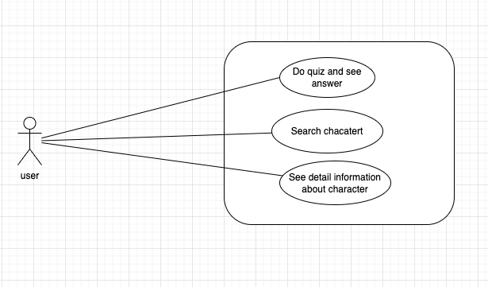

# Introduction (Введение)  
1. Purpose (Цель)
Mục đích của SRS là mô tả hành các, các ràng buộc, yêu cầu cụ thể của app, nhằm mục đích tạo ra 1 app trực quan về các nhân vật trong Series phim/truyện Harry Potter.  
2. Scope (Phạm vi)  
Tài liệu này dùng để tham khảo, hướng dẫn và mô tả các quy trình trước khi bắt đầu phát triển app, cũng như làm tài liệu tham khảo cho các nhà phát triển trong quá trình phát triển app. Bất cứ ai muốn phát triển app đều có thể tham khảo tài liệu này.
3. Definitions, Acronyms, and Abbreviations  
- SRS: Software Requirements Specification
- App: Ứng dụng
- Maui: Multi-platform App UI
- Use case: Sơ đồ use case
- UI: User Interface
- API: Application Programming Interface
- DB: Database
4. Overview  
Tài liệu này bao gồm 3 phần chính:
- Phần 1: Giới thiệu
- Phần 2: Mô tả tổng quan các chức năng, đặc điểm, ràng buộc của app
- Phần 3: Mô tả chi tiết hơn các chức năng, đặc điểm, ràng buộc của app
Phần 2 và 3 sẽ được mô tả chi tiết hơn trong các phần sau.
# Overall Description
1. Product functions  
App sẽ cung cấp 1 giao diện trực quan về các nhân vật trong Series phim/truyện Harry Potter, nhằm mục đích nâng cao hiểu biết, dễ dàng nắm bắt, tìm kiếm thông tin về các nhân vật trong Series phim/truyện Harry Potter. Và sẽ có thêm 1 số chức năng như quiz, dùng để kiểm tra hiểu biết và tăng cường kiến thức về bộ phim/truyện Harry Potter.  
2. User characteristics
- Người dùng: Các fan của Series phim/truyện Harry Potter, những người muốn tìm hiểu về các nhân vật trong Series phim/truyện Harry Potter.
3. Assumptions and dependencies
- App sẽ phụ thuộc vào API "https://hp-api.onrender.com" để lấy dữ liệu  
- App sẽ cần dùng internet để lấy dữ liệu từ API
4. Constraints
- Các chức năng của app vẫn sẽ hoạt động khi không có internet, vì API sẽ chỉ được gọi 1 lần đầu tiên khi tải app, sau đó sẽ lưu dữ liệu vào DB, và các chức năng sẽ lấy dữ liệu từ DB. Nhưng khuyến khích người dùng sử dụng app khi có internet để có thể cập nhật dữ liệu mới nhất.
# Specific Requirements
1. Functionality  
- Xem danh sách học sinh, và giáo viên  
- Xem toàn bộ danh sách nhân vật
- Tìm kiếm nhân vật theo tên, diễn viên, nhà, giới tính, wand...  
- Xem thông tin chi tiết của nhân vật
- Làm quiz về Series phim/truyện Harry Potter, ví dụ như đoán tên nhân vật qua hình ảnh, đoán tên nhân vật qua thông tin, đoán nhân vật thuộc nhà nào, đoán màu mắt của nhân vật, đoán xem nhân vật này thuộc nhà nào, màu tóc của nhân vật.....
 
2. Usability
- App sẽ có giao diện trực quan, dễ dàng sử dụng.
- Dich vụ sẽ được cung cấp miễn phí.
- App sẽ có thể chạy trên các nền tảng khác nhau như Android, IOS, Windows, MacOS, Linux.
3. Reliability
- Độ tin cậy sẽ luôn ở mức 100%, vì app sẽ không có chức năng liên quan đến việc giao tiếp với người dùng, mà chỉ là hiển thị thông tin.
- Lỗi sẽ luôn được hạn chế tối đa, và sẽ được fix trong thời gian sớm nhất.
4. Performance
- Performance sẽ luôn ở mức tốt nhất, lần đầu tiên sẽ có thể mất thời gian để tải dữ liệu từ API, nhưng sau đó sẽ lưu vào DB, và các chức năng sẽ lấy dữ liệu từ DB, nên sẽ không tốn thời gian để tải dữ liệu.
- App khá là nhẹ, vì thế sẽ không tốn nhiều tài nguyên của máy. Hầu như bất cứ máy nào cũng có thể chạy được app.
5. Design Constraints
- App sẽ được thiết kế theo mô hình MVVM.
- Dùng công nghệ Maui để thiết kế giao diện.
- Ngôn ngữ sẽ được sử dụng là C#.
- Thư viện bên thứ 3 là syncfusion, đây là thư viện miễn phí, và được sử dụng để thiết kế giao diện.
6. Interfaces
- User Interfaces:
  - Màn hình thứ nhất sẽ có 1 màn hình chính homepage, hiển thị danh sách học sinh và giáo viên
  - Màn hình thứ 2 sẽ có 1 màn hình hiển thị toàn bộ danh sách nhân vật
  - Màn hình tìm kiếm nhân vật, sẽ ở cùng màn hình với màn hình thứ 2
  - Màn hình thứ 3, là chi tiết nhân vật
  - Màn hình thứ 4, là quiz, chứa các câu hỏi về Series phim/truyện Harry Potter
- Hardware Interfaces: Không có
- Software Interfaces: App sẽ hoạt động dựa trên API "https://hp-api.onrender.com"
- Communications Interfaces: Không có
7. Licensing and Installation Requirements
App sẽ có mã nguồn mở, và sẽ được cung cấp miễn phí. Bất cứ ai cũng có thể tải về và sử dụng.
# Kết luận
Trong quá trình biên soạn ra tài liệu này, tôi đã học được nhiều điều, như vẽ sơ đồ use case, biết cách viết tài liệu SRS, cảm ơn vì đã đọc đến đây. 